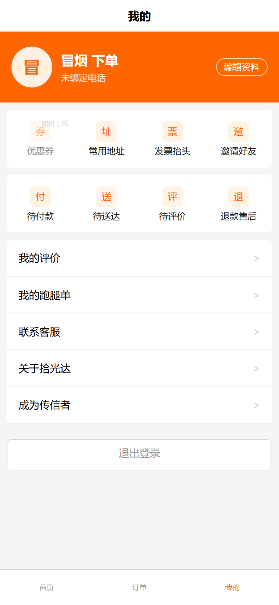
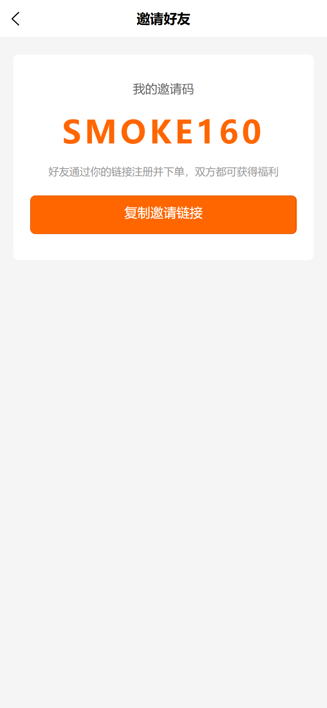
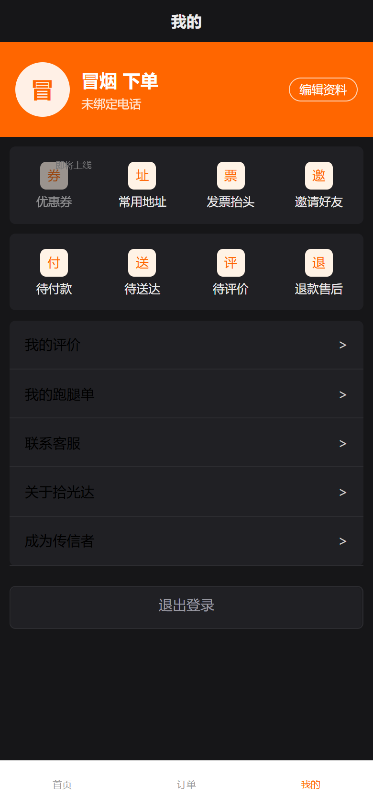

# 拾光达 外卖个人中心操作手册

> 适用范围：C 端学生（H5）
> 上线日期：2026-10-07
> 冒烟复跑：`python scripts/_smoke_profile.py`（幂等可重跑：六页截图 + 地址簿增改 + 抬头管理 + 邀请码 + 开票幂等）
> 计划文档：`docs/superpowers/plans/2026-10-07-waimai-profile.md`（12 任务，已全部收口）

## 1. 个人中心首页（profile 版式 B）

- 入口：底部 tab「我的」。
- 版式 B：橙色头部（头像 + 昵称 + 未登录态「点击登录」）+ **资产区四宫格**（余额/积分/优惠券/邀请奖励）+ **订单快捷条**（待付款/待取货/待送达/售后，带各状态角标数字）+ 功能清单（地址簿/发票抬头/联系客服/关于等）。
- 未登录点任意功能自动跳登录页。

## 2. 资料编辑（profile-edit）

- 入口：首页点头像/昵称区。
- 可改：**头像**（调用 `uploadCustomerAsset` 上传换图）、昵称、手机号。
- 保存后即时回显首页。

## 3. 地址簿（address-book / address-edit）

### 3.1 地址列表

- 入口：首页「地址簿」。
- 功能：**默认徽标**、一键「设默认」、删除（**二次确认**）、
  失效地址（分区/楼栋已下架）**置灰并提示「待更新」**，点击进编辑页修正。

### 3.2 地址编辑

- 新建/编辑同一页：**分区 → 楼栋级联选择**（复用 campus 接口，数据与点单页一致）+ 详细地址 + 联系人 + 手机号 + 默认开关。
- 编辑失效地址时自动回填原值供修改；保存要求 `countryCode`（本 fork 必填，`availableCountries` 仅 CN）。

## 4. 发票抬头管理（invoice-titles）

- 入口：首页「发票抬头」。
- 支持**个人 / 企业**两类抬头；企业抬头**税号校验**（必填、15/18/20 位数字与字母）；
- 每类最多 **5 条**，新增置顶并可设默认。

## 5. 订单开发票（order-detail 弹层）

- 入口：**订单详情 →「开发票」按钮**。
- 显示条件：订单状态为已支付/已发货/已送达，且该单**未申请过**发票（已申请则顶部显示「已提交开票申请」只读条，按钮隐藏）。
- 流程：弹层选抬头（来自第 4 节的抬头列表，可现场新增个人抬头）→ 填接收邮箱 → 提交。
- 幂等保护：同一订单重复提交返回 `INVOICE_ALREADY_APPLIED`，前端提示「该订单已申请过发票」。

## 6. 邀请好友与关于（invite / about）

- **邀请好友**：展示专属**邀请码**（如 `SMOKE160`），一键复制邀请链接。
- **关于**：版本号、客服电话（env 配置）、用户协议/隐私政策入口。

## 7. 下单联动：默认地址预选（checkout）

- 进入结算页自动按「当前城市 + 校验 zone/building 有效性」**预选默认校园地址**，摘要行显示并支持「改选」；
- 配送时段仍需手动选择，不会自动带出。

## 8. 验证与取证

- 冒烟脚本：`python scripts/_smoke_profile.py`
  （覆盖：六页渲染截图、地址簿建址/更新/`countryCode` 必填、抬头管理与 ≤5 条约束、邀请码渲染、`applyOrderInvoice` 首调 + 幂等拒重、暗色抽查）
- 截图归档：`docs/screenshots/profile/`（7 张：首页/资料/地址簿/抬头/邀请/关于/暗色抽查）
- 部署：dist 构建产物随最新提交同步线上。
- **暗色主题**（2026-10-07 方案 A 落地）：中性色令牌 CSS 变量化（uni.scss → var）+ App `onLaunch` 补调 `initTheme()`，全站 `$` 变量样式自动跟随；个人中心各页深色卡片/浅色文字，**橙色头部保持品牌色**，原生导航栏与 tabBar 同步翻转。首页右上角 🌙/☀️ 可切换。

