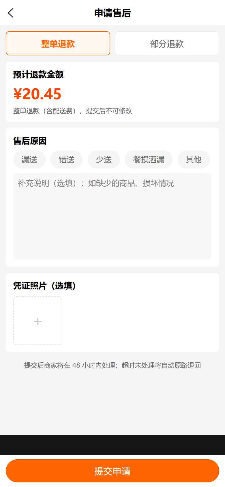
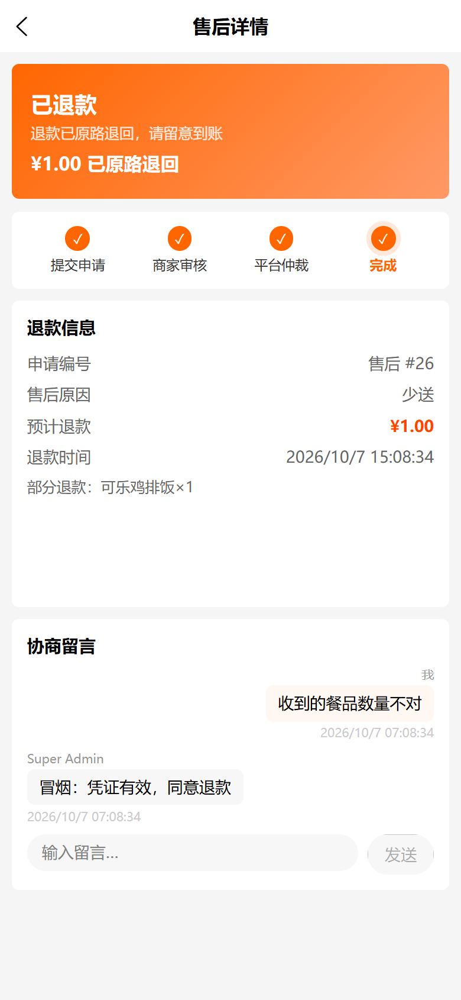
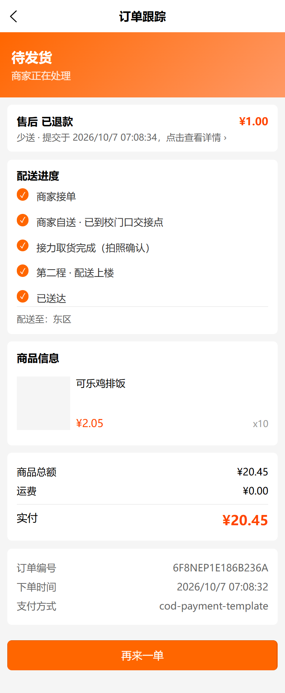
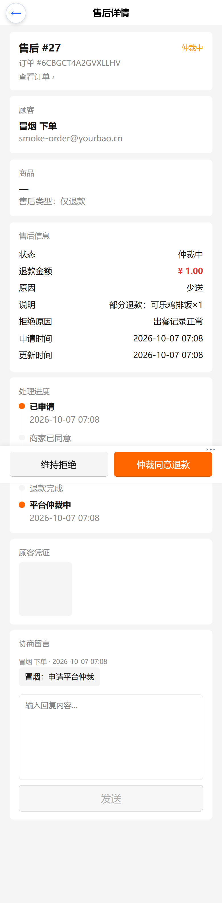

# 拾光达 外卖售后/退款操作手册

> 适用范围：C 端学生（H5）/ 商家（web-admin）/ 平台（web-admin）
> 上线日期：2026-10-07
> 冒烟复跑：`python scripts/_smoke_aftersale.py`（全链路：下单→送达→售后→拒绝→申诉→仲裁退款）

## 1. 用户侧（C 端 H5）

### 1.1 入口与条件

- 入口：**订单详情页 →「申请售后」按钮**。
- 显示条件（三者同时满足）：
  1. 订单已由骑手送达（`deliveryStatus = delivered`）；
  2. 送达后 **24 小时内**（以骑手送达落库时间为准）；
  3. 该订单**没有进行中的售后单**（已关闭的除外）。
- 未接单/待发货的取消仍走「取消订单」，与售后链路互不交叉。

### 1.2 申请流程（版式 A 清单勾选式）

1. 选择退款方式：**整单退款**（含配送费，金额=实付）或 **部分退款**。
2. 部分退款：勾选商品行 + 调整数量，金额按行实付均摊自动计算（**不可手填**）。
3. 选择售后原因：漏送 / 错送 / 少送 / 餐损洒漏 / 其他，可补充说明。
4. 凭证照片：**部分退款必传 1-3 张**；整单退款选填（≤5MB，jpg/png/webp）。
5. 提交后跳转售后详情页；商家 **48 小时未处理将自动同意并原路退回**。



### 1.3 售后状态含义

| 状态 | 文案 | 含义 / 用户可做什么 |
|---|---|---|
| Pending | 商家审核中 | 可撤销申请 |
| Approved | 商家已同意 | 退款处理中 |
| Received | 待退款 | 退款处理中（原路退回） |
| Refunded | 已退款 | 展示退款时间/退款单号 |
| RefundFailed | 退款失败处理中 | 系统自动重试（1 次），失败后平台人工处理 |
| Rejected | 商家已拒绝 | 展示拒绝理由，**可申请平台仲裁** |
| Appealed | 平台仲裁中 | 等待平台仲裁，可继续留言补充 |
| Closed | 已关闭 | 商家撤销或仲裁维持拒绝；可重新发起新售后 |



### 1.4 申诉时机

- 商家拒绝后，若不认可理由，在售后详情「商家拒绝理由」卡片点 **申请平台仲裁**，填写申诉说明（必填）。
- 仲裁同意 → 自动原路退款；仲裁维持拒绝 → 售后关闭（理由展示给用户）。



## 2. 商家侧（web-admin）

### 2.1 审批

1. 菜单：**售后管理**，默认关注「待处理」页签（Pending）。
2. 点开售后详情：核对订单、商品行、凭证照片、协商留言。
3. 操作：
   - **同意**：refund_only 单同意后**自动原路退款**（无需再点退款）；
   - **拒绝**：拒绝理由**必填**（展示给用户，被拒后用户可申诉）。
4. 可随时在详情页**留言**与用户协商（Closed 后停用）。
5. ⚠️ **48 小时未审批 → 系统自动同意并退款**，请及时处理。

### 2.2 退货类售后（非外卖主流程）

return_refund / exchange 单沿用既有流程：同意 → 用户寄回 → 确认收货 → 执行退款；换货单在 Received 态走「换货发货」。

## 3. 平台侧（web-admin）

### 3.1 仲裁

1. 售后列表新增「**仲裁中**」页签（Appealed）。
2. 进入详情，吸底按钮：
   - **仲裁同意退款**：确认后立即原路退回（金额=申请金额）；
   - **维持拒绝**：仲裁说明**必填**（展示给用户），售后关闭。



### 3.2 退款失败处理

- 「退款失败」页签（RefundFailed）→ 详情 **重试退款**；失败原因见详情「退款错误」字段。
- 系统已内置自动重试 1 次。

## 4. 已知边界

- 仅**骑手送达单**可售后（`deliveryStatus=delivered`）；R2 快递到校/自取单确认收货后同样适用。
- 被拒单**只能申诉，不能重提**；关闭后可重新发起新售后（24h 窗口内）。
- 24h 窗口以骑手送达落库时间（`deliveredAt`）为准，后端创建时二次校验。
- 部分退款金额上限=实付总额，超额后端拒绝并落 `RefundFailed` 留痕。
- 骑手异常赔付（黄条）与售后卡在订单详情**共存不互斥**。

## 5. 冒烟复跑

```bash
python scripts/_smoke_aftersale.py
# 期望输出：AFTER-SALE SMOKE PASS
# 截图输出：docs/screenshots/aftersale/*.png
```
