# 拾光达 外卖骑手端操作手册

> 适用范围：骑手（H5，手机浏览器 / 微信内打开）
> 上线日期：2026-10-07
> 冒烟复跑：`python scripts/_smoke_route_group.py`（顺路组全链路：双单同组→整组抢单→批量送达）、`node .secrets/rider-withdraw-e2e.cjs`（钱包提现 e2e）
> 计划文档：`docs/2026-10-05-waimai-plan3-rider-deploy.md`（Plan 3，Task 1-5 已完成）

## 1. 入驻（rider-join）

### 1.1 入口与条件

- 入口：骑手端首页（`#/pkg-rider/pages/rider-home`），未入驻/未过审时显示引导卡。
- 需要登录后填写入驻申请，**审核通过前不能接单**。

### 1.2 申请流程

1. 填写姓名、手机号、常用配送地址等基本信息；
2. 上传**学生证照片**（存证审核）；
3. 提交后进入「审核中」状态卡，审核结果回显同页（通过后大厅解锁）。

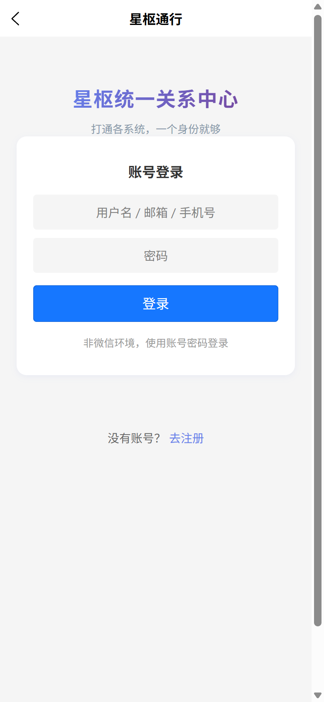
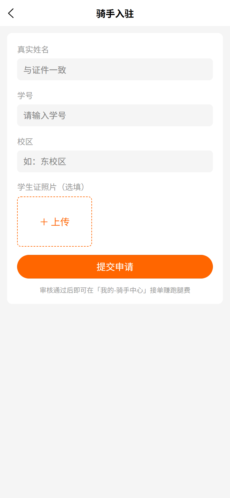
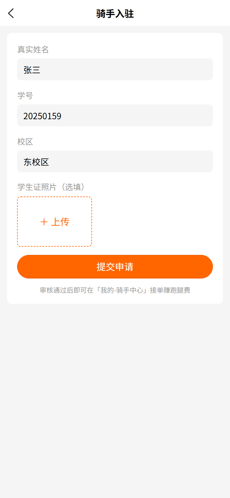

## 2. 接单大厅（rider-home）

### 2.1 在线开关

- 首页右上角「在线」开关：**开 = 接单中**（绿点），关 = 暂停接单。
- 开启在线后每 **30 秒发送一次心跳**，平台据此判断骑手在线状态。

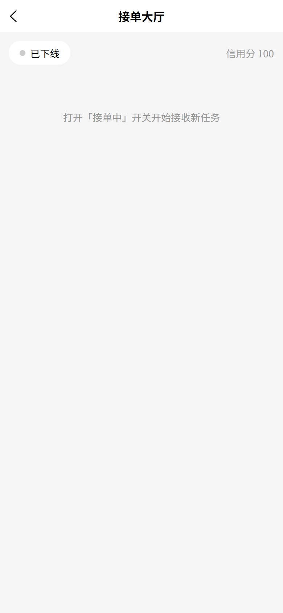
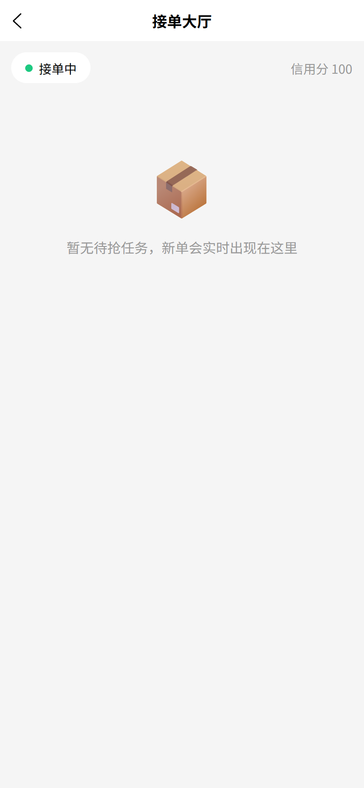

### 2.2 刷新与抢单

- 大厅列表 **10 秒轮询**自动刷新，无需手动下拉。
- 点「抢单」接走任务：采用**乐观锁**，被别人抢先会明确提示「抢单失败」，不会重复接单。
- 带 **加急徽标**的订单优先处理。

### 2.3 顺路合并组（多单顺路）

- 同一配送路线组（`routeGroupId`）的多个待抢单在大厅聚合成一组，组头显示「顺路 N 单」徽标；
- **抢单自动整组接走**，避免逐单抢、路线冲突。

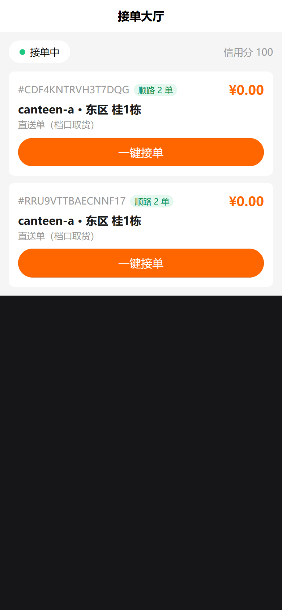
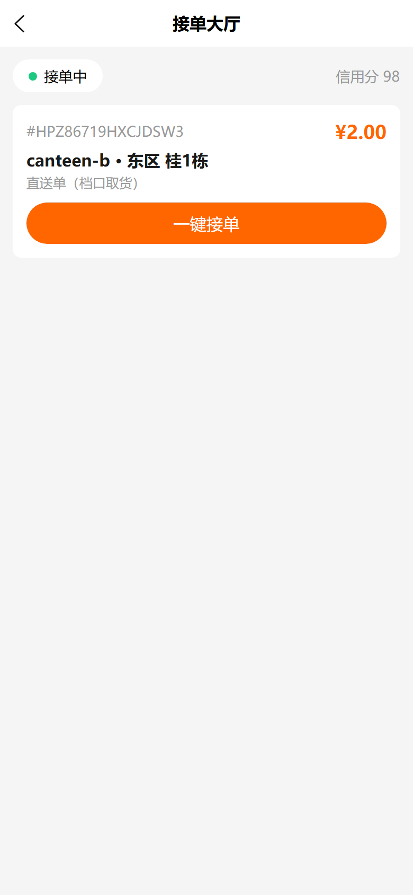

## 3. 配送中（rider-delivering）

### 3.1 状态流转

| 状态 | 含义 | 可用操作 |
|---|---|---|
| 待取货（assigned） | 已接到单，未到店 | **我已到店 · 开始取货**、转单（未取货） |
| 已取货 · 配送中（in_progress） | 取货完成，配送路上 | **我已送达（拍照存证）**、转单（已取货 · 拍照交接） |
| 已送达（delivered） | 完成 | 展示「分成 ¥xx 已入账」 |
| 异常（exception） | 异常处理中 | 平台将介入协调 |

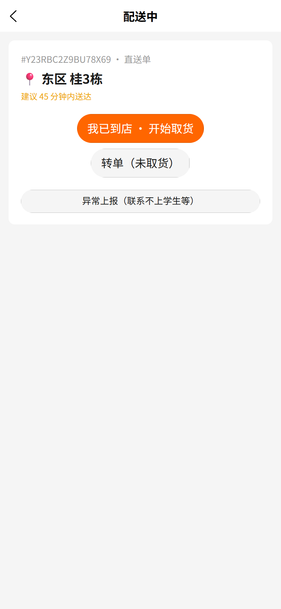
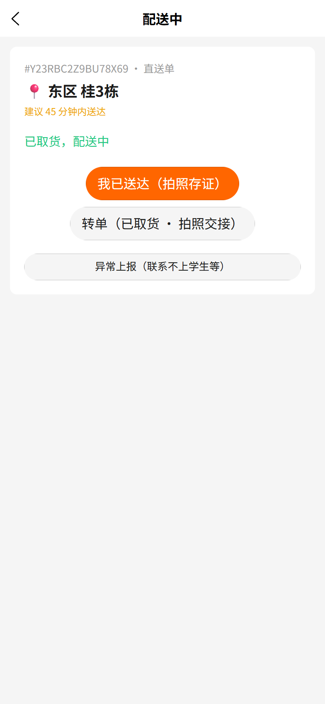
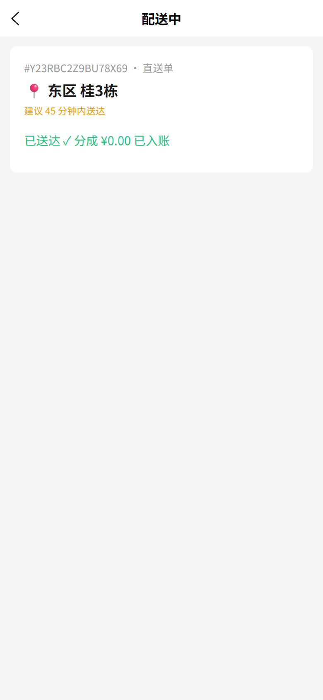

### 3.2 送达与拍照（硬性要求）

- **送达必须拍照存证**（必填，跳过会被拦截）；
- 送达成功后分成金额实时入账并提示。

### 3.3 顺路组批量操作

- 组卡聚合展示路线组内全部子单：**整组待取货 → 一键「我已到店 · 开始取货（N 单）」**；
- 配送中 → 点圆圈**勾选子单 → 「送达勾选的 N 单 · 拍照存证」**（一次拍照，逐单入账分成）；
- 组头实时显示进度「已送达 x/N」。


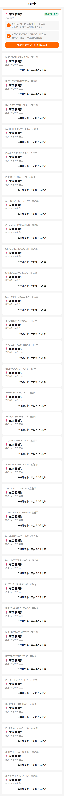


### 3.4 转单

- **未取货转单**：无需拍照；
- **已取货转单**：强制**拍照交接**（凭据防纠纷）；
- 转单后任务回到大厅，供其他骑手抢。

### 3.5 位置上报与用户追踪

- 配送中每 **10 秒上报一次骑手位置**（gcj02）；用户在订单详情页可看到骑手 Marker 地图追踪。

### 3.6 催单提醒

- 用户在订单详情点「催单」后，骑手配送页出现**催单横幅**（⚠ 用户已催单，请尽快送达），组头同步提示。

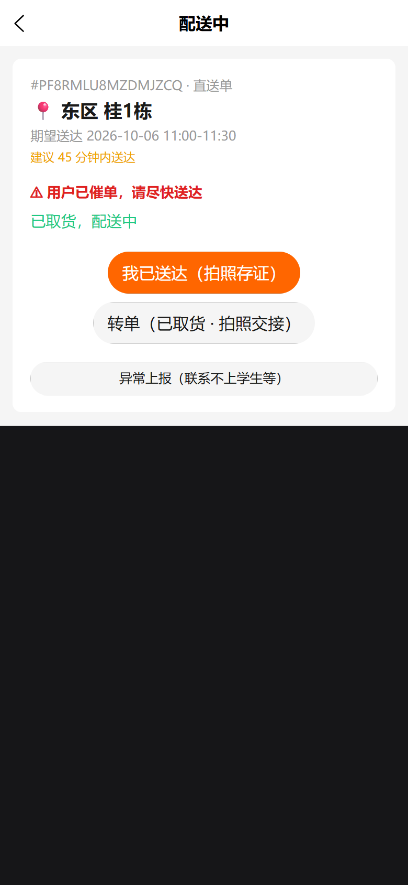

### 3.7 异常上报（页内面板）

- 配送页每张子单均有「异常上报」入口，**四类型按配送状态过滤**：

| 异常类型 | 可上报状态 | 说明 |
|---|---|---|
| 商家无法出餐 | 待取货 | 到店后发现商家出不了餐 |
| 联系不上收件人 | 配送中 | 多次联系无果 |
| 餐品洒漏损坏 | 配送中 | **必须拍照存证**（餐损凭据透出给平台/商家） |
| 其他 | 两者均可 | 备注必填 |

- 上报后任务进入「异常处理中」，平台介入；处理结果回显用户订单详情。

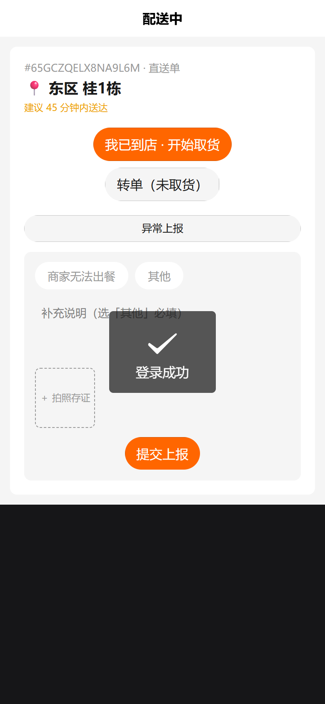
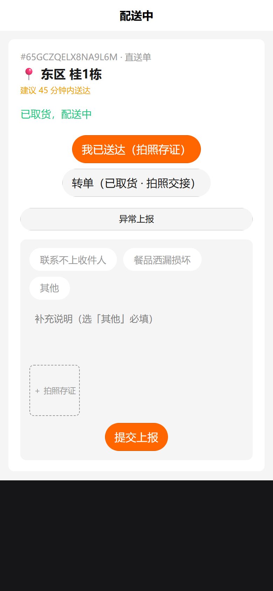

## 4. 收入明细（rider-earning）

- **今日 / 本周 KPI**：单量、分成金额汇总；
- 分成流水列表（每单一条，含分成金额与时间）；
- 展示**信用分**（违规/异常率影响）。

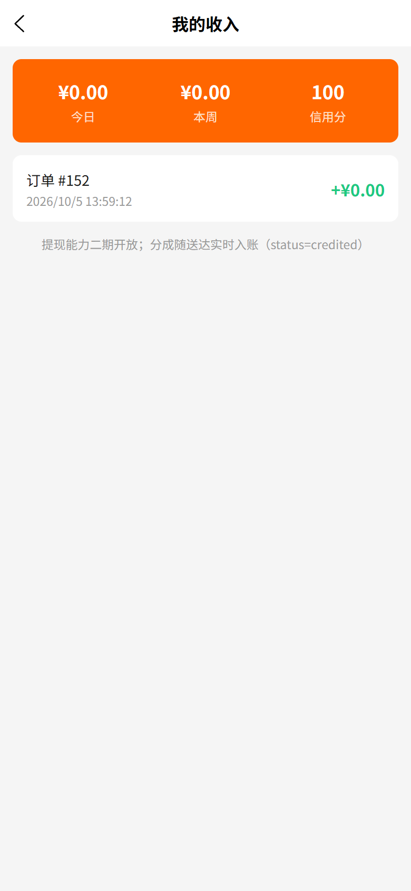

## 5. 钱包与提现（rider-wallet / rider-withdraw）

- 钱包页展示可提现余额；切到「提现记录」tab 会主动加载首屏流水；
- 提现申请：
  - **最低提现 ¥10**（低于拦截提示）；
  - 支持「全部提现」一键填入；
  - 提交后进入提现记录，状态回显。

## 6. 常见问题

| 问题 | 原因与处理 |
|---|---|
| 抢单失败 | 多为被其他骑手抢先（乐观锁保护），大厅 10 秒内自动刷新可抢下一单 |
| 大厅无单 | 确认右上角「在线」已开启；无心跳会被判定离线 |
| 接单入口不可用 | 入驻还在审核中，或审核被驳回（进入驻页查看状态） |
| 送达按钮拦截 | 送达拍照为必填项，请拍摄餐品/交付凭据 |
| 看不到某店铺订单 | 大厅已做跨店铺渠道聚合，若仍缺失请联系平台检查该渠道 `campusHall` 配置 |

## 7. 验证与取证

- 全链路冒烟（双单顺路组）：`python scripts/_smoke_route_group.py`
- 钱包提现 e2e：`node .secrets/rider-withdraw-e2e.cjs`
- 截图归档：`docs/screenshots/plan3/`（入驻/大厅/配送/收入 11 张）+ `docs/screenshots/wa-rider-*.png`（顺路组/异常面板/催单 7 张）
